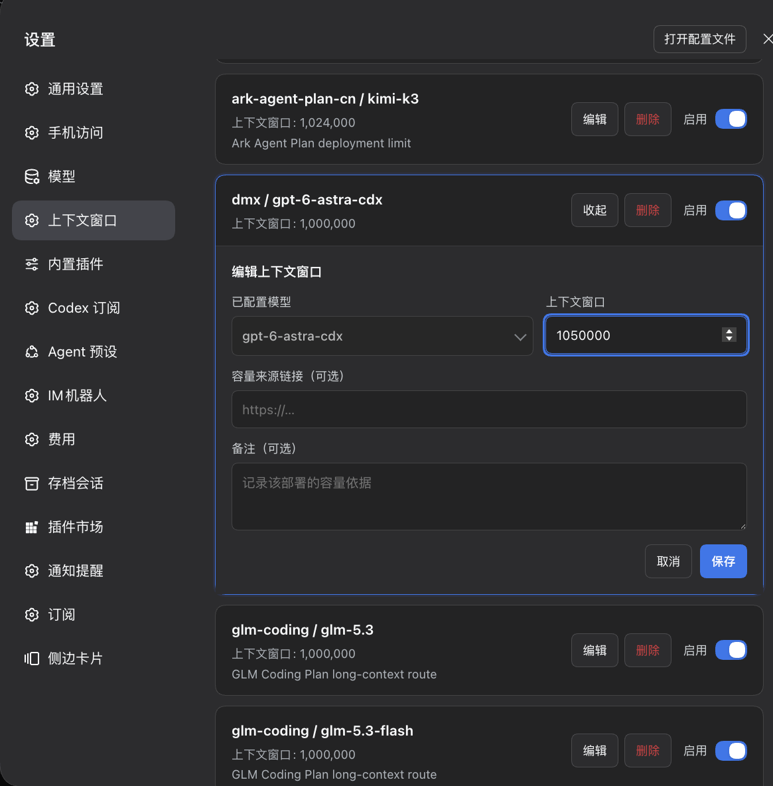

<a id="top"></a>

<div align="center">
<h1>Model Context Catalog</h1>

[](https://www.npmjs.com/package/dsh-model-context-catalog)
[](https://www.npmjs.com/package/dsh-model-context-catalog)
[](https://github.com/HOWILLMAKEIT/dsh-model-context-catalog/actions/workflows/ci.yml)
[](https://github.com/deepseek-ai/deepseek-harness)
[](./LICENSE)

**为 DSH 的自定义模型路由集中维护上下文窗口。**

[适用场景](#适用场景) · [工作方式](#工作方式) · [安装与使用](#安装与使用) · [中转站 API](#中转站-api) · [开发](#开发)
</div>

`dsh-model-context-catalog` 按 **provider / model** 路由保存上下文窗口，并自动同步到 DeepSeek Harness 的模型配置，适用于手动接入的模型服务、中转站和模型别名。

首次安装时列表为空，插件不提供默认容量。添加模型并填写窗口后，通过 **启用** 开关决定是否持续管理。升级会保留已有条目和启停状态。

<p align="center">
  
</p>

<p align="center"><sub>自定义模型的实际设置界面：填写窗口大小，通过开关启用管理。</sub></p>

## 适用场景

| 场景 | 插件用途 |
| --- | --- |
| 手动接入模型服务，使用自定义 provider，而非内置 provider | 为该服务下的各个模型填写准确窗口，补充内置目录无法提供的容量信息 |
| 通过中转站调用模型，接口未提供窗口大小，或模型 ID 使用别名 | 按中转站对该模型的实际限制填写窗口，并自动同步到模型配置 |
| 同一个模型接入不同服务、套餐或部署，各自的容量限制不同 | 按 provider / model 分别维护窗口，避免将一条路由的限制套用到另一条路由 |
| 使用内置 provider，且内置窗口与实际服务限制一致 | 可直接使用 DSH 的容量信息，通常无需插件重复维护 |
| 已准确配置多个模型的窗口，希望统一查看和修改 | 在插件中集中维护并持续同步；容量相同时不重复写入 |

## 工作方式

在插件中选择已经配置的模型，填写窗口大小并启用条目。插件会将目录中的容量同步到该模型的 `contextWindow`；之后修改目录，模型配置也会随之更新。


同步只修改上下文窗口，保留模型的 API 地址、凭据、名称和输出上限。容量声明错误可能导致上下文超限误判，相关原理见 [ROOT_CAUSE.md](./ROOT_CAUSE.md)。

## 安装与使用

### 安装

安装到 DSH Web profile：

```bash
dsh plugin --profile web add dsh-model-context-catalog
```

安装后，在 DSH 插件管理器中确认插件已启用。若尚未加载，重启 DSH 并刷新 Web 页面。

### 使用

#### 为模型设置窗口

1. 在 DSH **模型设置**中完成模型接入，包括模型服务的 API 地址、调用协议、凭据和模型列表。插件只能选择这里已经添加的模型。
2. 打开 **设置 → 上下文窗口**。如果页面已有这个模型的条目，点击 **编辑**；如果没有，点击 **添加模型**。
3. 新增条目时，从对应服务商的分组中选择模型。同名模型可能属于不同服务，请核对所选服务商和模型 ID。
4. 在 **上下文窗口**中填写服务商确认的 token 数，使用正整数。例如，文档写明窗口为 128,000 tokens，就填写 `128000`。**容量来源链接**和**备注**可选，用来记录数值依据。
5. 点击 **保存**。新条目默认启用，插件随后将窗口写入 DSH 的模型配置。编辑已有条目时，保存会保留原来的启停状态。

#### 修改窗口或停止同步

条目启用期间，应在本插件中修改窗口。若直接修改 DSH 模型设置中的窗口，插件会再次将它同步为本插件保存的值。

| 操作 | 结果 |
| --- | --- |
| **编辑 → 保存** | 保存新窗口，保留原来的启停状态；已启用的条目会自动同步 |
| **关闭启用开关** | 保留插件条目，停止同步；DSH 模型配置中已有的窗口保持原值 |
| **打开启用开关** | 恢复同步，将该条目保存的窗口写入模型配置 |
| **删除** | 移除插件条目并停止同步；不会删除 DSH 中的模型，也不会清除已经写入的窗口 |

如果以后希望直接在 DSH 模型设置中管理窗口，先关闭插件中的 **启用** 开关，再去修改模型配置。

#### 同步提示

正常条目只显示窗口与启用开关。启用表示插件正在管理该条目；如果模型配置尚未与保存的窗口一致，页面会提示 **模型配置尚未同步**。保存后可稍候查看，持续未同步时检查插件是否运行及 DSH 日志。

如果模型已从 DSH 中移除，页面会提示重新添加模型或删除该条目。保存或切换开关失败时，页面会显示写入错误。停用条目不提示同步问题。

## 中转站 API

**使用中转站不等于一定要手动填写；关键是它是否提供准确、可读取的容量元数据。**

如果中转站的 `/models` 接口提供窗口大小，可以通过 DSH 模型发现导入，再在插件中集中维护。

如果接口只返回模型 ID、名称或价格，DSH 无法据此知道实际窗口。此时需要查中转站该路由的文档或控制台，在插件里手动填写一次。插件负责保存和持续同步，不自动探测上限，也不把原厂窗口套用到模型别名。

查询容量时，应以中转站的模型文档、控制台或套餐说明为准。模型名称相同，不代表中转站提供的窗口与原厂上限相同。

同一中转站下的不同模型可能有不同限制，应分别维护各模型的窗口。

## 同步范围

- 管理 `llm-pi-ai` 中已经添加的服务与显式模型列表，按 provider / model 匹配并同步窗口。
- 使用内置目录、未显式列出模型的路由，以及 `modelOverrides`，不在当前同步范围内。
- 插件负责容量配置的维护，响应分类、摘要和自动压缩仍由 DSH 处理。

窗口由用户按对应部署的限制填写；插件不内置任何模型的容量目录。

## 开发

```bash
npm ci
npm run check
npm test
npm pack --dry-run
```

本地开发时，可将源码目录链接到 DSH：

```bash
dsh plugin --profile web add -w /absolute/path/to/dsh-model-context-catalog
```

测试覆盖目录同步、配置冲突、其他模型字段保留和设置页保存行为。

源码位于 `index.js`、`catalog.js`、`client.js`；`lib/` 是构建产物。贡献规则见 [CONTRIBUTING.md](./CONTRIBUTING.md)，版本记录见 [CHANGELOG.md](./CHANGELOG.md)。问题可提交到 [GitHub Issues](https://github.com/HOWILLMAKEIT/dsh-model-context-catalog/issues)。

## License

[MIT](./LICENSE)
