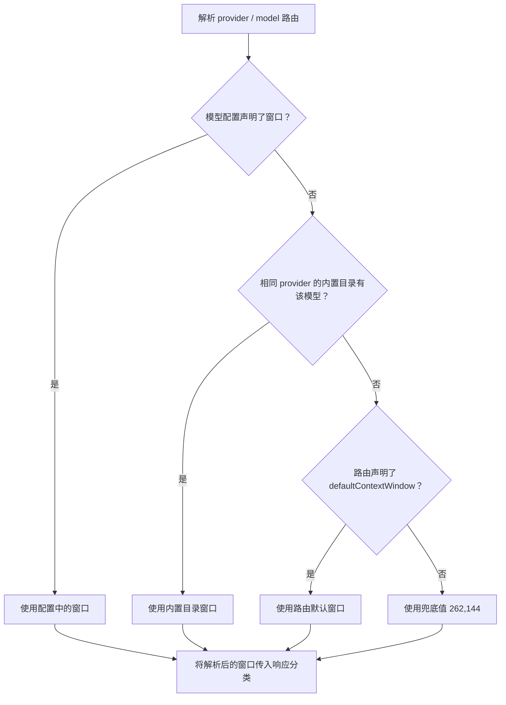

# 自定义模型路由的上下文窗口与溢出误报

更新日期：2026-10-07。当前分析对照 DSH `0.2.0-rc.2`、pi-ai `0.87.1`；插件维护版本为 `0.3.0`。

## 当前结论

**DSH 已为内置 provider 下的部分 GLM 模型提供准确容量，但自定义模型路由仍需要明确维护自己的上下文窗口。** 内置目录按 provider 标识与模型 ID 匹配，不会因为模型同名或 API 地址相同，就把另一个 provider 的容量继承给自定义路由。

缺少模型容量、内置目录又无法匹配时，DSH 使用路由级 `defaultContextWindow`；该默认值未配置时为 **262,144 tokens**。这是兜底容量，不是服务商确认的限制。

当前 pi-ai 仍会根据声明窗口检查成功结束的响应。窗口被低估、返回用量又超过该值时，DSH 仍可能生成：

```text
pi-ai detected context overflow for model "…"
```

因此，本插件的当前用途是：**按精确的 provider / model 集中维护部署容量，并同步到原生模型配置，避免自定义路由持续使用错误窗口。** 是否需要插件取决于维护方式；准确的原生配置也能声明容量，插件提供集中管理与持续同步。

## 为什么自定义 provider 不继承内置容量

provider 是 DSH 中一组模型服务配置的标识，其配置包含 API 地址、凭据和模型列表。自行接入服务时使用的新标识，如果没有被内置目录收录，就属于没有内置容量目录的自定义 provider。

DSH 的 [`catalogModels(provider)`](https://github.com/deepseek-ai/deepseek-harness/blob/dsh-v0.2.0-rc.2/packages/llm/llm-pi-ai/src/catalog.ts#L182-L185)仅查询传入 provider 的目录，不跨 provider 搜索模型，也不通过 endpoint 判断它属于哪个内置服务。

以本机 GLM 配置为例：

| 配置方式 | 容量来源与解析结果 |
| --- | --- |
| 使用内置 `zai-coding-cn`，选择目录中的 `glm-5.3` 或 `glm-5.3-flash` | 本机 pi-ai 内置目录提供 1,000,000 tokens |
| 使用自定义 `glm-coding`，在模型行声明 1,000,000 | 使用用户配置的值；不是从 `zai-coding-cn` 继承 |
| 使用自定义 `glm-coding`，未声明模型窗口或路由默认窗口 | 即使模型 ID 相同，也回退到 262,144 |

本机 `glm-coding/glm-5.3-flashx` 使用自定义模型 ID，其容量同样由用户目录维护，不能用另一个内置模型的名称替代来推断限制。

上述数值区分了内置元数据与本机声明；本次没有通过真实长请求重新测量服务商的容量上限。

## 当前容量解析路径

对已有模型条目，DSH 的解析顺序是：**模型配置声明 → 相同 provider 的内置模型目录 → 路由默认值**。[容量解析源码](https://github.com/deepseek-ai/deepseek-harness/blob/dsh-v0.2.0-rc.2/packages/llm/llm-pi-ai/src/catalog.ts#L849-L865)



路由未声明默认窗口时，使用 [`DEFAULT_CONTEXT_WINDOW = 262_144`](https://github.com/deepseek-ai/deepseek-harness/blob/dsh-v0.2.0-rc.2/packages/llm/llm-pi-ai/src/config.ts#L59-L60)。只有确认一条路由下所有目标模型的容量相同时，才适合统一设置路由默认值；不同模型应分别声明。

中转站也遵循这条规则。DSH 的[模型发现](https://github.com/deepseek-ai/deepseek-harness/blob/dsh-v0.2.0-rc.2/packages/llm/llm-pi-ai/src/discovery.ts#L195-L215)支持读取 `/models` 返回的 `contextWindow`、`context_window`、`context_length`、`max_input_tokens`、`limit.context`。有可用容量字段时可导入；只有模型 ID 或名称时，仍需查询该部署的实际限制并填写。

## 窗口错误如何导致溢出误报

pi-ai `0.87.1` 保留成功响应的用量检查：终止原因是 `stop`，且 **输入用量与缓存读取用量之和大于传入窗口** 时，判定为上下文溢出。[pi-ai 判定源码](https://github.com/earendil-works/pi/blob/v0.87.1/packages/ai/src/utils/overflow.ts#L145-L151)

DSH 的 `mapStopReason` 随后将该结果转换为 `CONTEXT_WINDOW_EXCEEDED`；响应没有服务端错误文本时，生成 `pi-ai detected context overflow …`。[DSH 响应分类源码](https://github.com/deepseek-ai/deepseek-harness/blob/dsh-v0.2.0-rc.2/packages/llm/llm-pi-ai/src/stream.ts#L75-L87)

这条成功响应检查按终止原因与用量执行，并不只针对 GLM。自定义模型或中转站路由只要声明了偏小的窗口，也可能受到影响。

已用当前安装包的分类逻辑构造非空成功响应，令输入用量为 724,675、缓存读取为 0、输出为 16，得到：

| 传入窗口 | 终止原因 | DSH 分类结果 |
| ---: | --- | --- |
| 262,144 | `stop` | `CONTEXT_WINDOW_EXCEEDED` |
| 1,000,000 | `stop` | 正常结束 |
| 262,144 | `toolUse` | 正常工具调用 |

这验证了错误窗口仍可触发误报，也解释了历史会话中“工具循环继续执行、最终回答失败”的现象。模拟消息不用于证明任何服务商的真实容量。

同一错误代码也可能来自服务端明确返回的真实超限错误。判断根因时，需要核对原始响应、终止原因、用量和容量来源，不能把所有上下文溢出都归因于兜底值。

## 新版压缩恢复与历史故障的区别

DSH `0.2.0-rc.2` 的 `compaction-basic` 已加入溢出恢复路径：自动压缩启用时，收到上下文溢出错误会尝试压缩，并受 `maxOverflowRetries` 限制。摘要阶段失败但已有持久化的上下文缩减时，也可以基于缩减后的上下文重试。[当前压缩恢复源码](https://github.com/deepseek-ai/deepseek-harness/blob/dsh-v0.2.0-rc.2/packages/compaction/compaction-basic/src/index.ts#L175-L217)

因此，旧调查中的“摘要失败后没有提交压缩结果、重复压缩失败”属于历史会话证据，不能直接作为新版压缩流程必然永久回滚的结论。新版恢复机制也不改变前面的 provider 匹配和窗口解析规则，准确的容量配置仍需维护。

## 插件修正的位置与能力边界

插件 `0.3.0` 通过新版 volatile Config 与 Settings 表单维护目录，使用 revision 校验和有限冲突重试，将启用条目的容量写到 `llm-pi-ai.providers[provider].models[]` 对应模型的 `contextWindow`。该字段优先于内置容量与默认值，所以后续请求可使用维护后的声明窗口。

新安装的目录为空，插件不提供默认路由或模型容量。升级保留用户已经保存的条目和启停状态，编辑保存不会自动启用停用条目。设置页通过启用开关控制管理；窗口尚未同步、模型被移除或写入失败时才显示提示。

同步只修改窗口字段，保留 API 地址、凭据引用、模型别名和输出上限 `maxTokens`。插件只处理已经显式配置的精确路由，不创建模型，不管理内置目录的 `modelOverrides`，也不改变溢出判定或压缩流程。

插件的能力取决于目录值准确：填写过大不能扩大服务端实际容量，填写过小仍可能影响响应分类。容量应来自服务商文档、控制台或明确部署证据；插件不自动探测上限，也不把原厂窗口套用到中转站别名。

停用或删除目录项会停止后续同步，已写入原生模型配置的容量仍保留。使用方式与适用场景见 [README](./README.md)。

## 历史会话证据

以下数据保留自此前针对 DSH `0.1.1-rc.2`、`0.1.2-alpha.3` 与 pi-ai `0.82.1` 的调查，本轮没有重新审计这些会话。

| 会话 | 历史观察 |
| --- | --- |
| `session-beb4a757-e2e9-4769-8c4e-5265fa627869` | 上下文估算 430,111；provider prompt 用量 544,630；声明窗口 262,144；10 个终止回合被判定溢出；49 次压缩失败；成功的 `compaction/summary` 为 0 |
| `session-cb8ee285-0e9b-445c-91b1-d11600923df6` | 同一模型此前在另一条路由声明 1,000,000；切换自定义路由后声明值变成 262,144；最高 724,675 tokens 的工具调用请求得到处理；7 个最终回合被判定溢出 |

这些观察支持“当时的 262,144 声明低于已成功处理的请求用量”，不能据此测定部署的完整窗口上限。历史代码锚点保留在 [DSH 旧版容量回退](https://github.com/deepseek-ai/deepseek-harness/blob/dsh-v0.1.1-rc.2/packages/llm/llm-pi-ai/src/catalog.ts#L851)与 [pi-ai 旧版判定](https://github.com/earendil-works/pi/blob/b4f293684bba718d59cc1157679bcf6157b3a7f5/packages/ai/src/utils/overflow.ts#L132-L161)。

## 当前验证范围

当前结论依据固定版本的上游源码、本机安装包与配置解析、内存中构造的分类回归。插件维护验证另覆盖真实 SettingsForms 服务联动及 React 设置页行为，使用离线 fixture。

2026-10-07 的插件维护验证中，37 项测试、构建与打包检查通过。隔离的完整 DSH Web profile 已验证启动同步与运行中修改目录后的持续同步；本机自定义路由页面已核对显式容量状态。真实长上下文模型请求尚未验证。

## 已保存但未同步的故障记录

`dmx / gpt-6-astra-cdx` 的排查确认：目录中保存的 1,000,000 不等于模型行已经声明该容量。模型行缺少 `contextWindow` 时，仍使用路由默认值 262,144。当时设置页用“路由默认值”和“已生效”标签区分两者；当前界面改为启用开关与未同步提示。

旧同步调度有两处问题：Loader 的 volatile 更新限定在被修改组件的 fiber，普通监听无法收到另一模型组件的更新；DSH 0.2 的 HMR 用 AsyncLocalStorage 标记事务，在更新通知内创建的 Promise 会继承事务，后续 Settings 写入被拒绝为 `HMR transactions cannot be nested`。简单延迟执行也不会清除这个异步上下文。

修复后跨组件监听 volatile 更新，并监听 profile 重载；排队前退出 HMR 的事务上下文，让 Settings 按原有串行事务队列完成独立写入。当前适配使用 DSH `0.2.0-rc.2` HMR 的内部 `executing.exit`，升级 DSH 时需复核该实现。隔离 profile 已复现修复前运行中修改不落盘，以及修复后自动落盘。

启用开关表示是否由插件管理条目。模型配置同步完成不证明中转站实际支持该容量，窗口仍应以对应部署的文档或验证结果为准。
